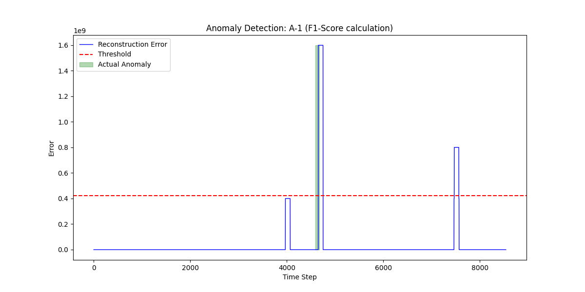
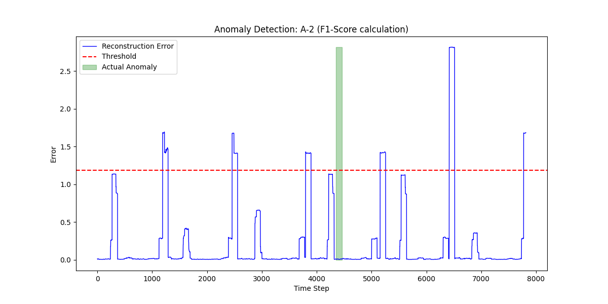
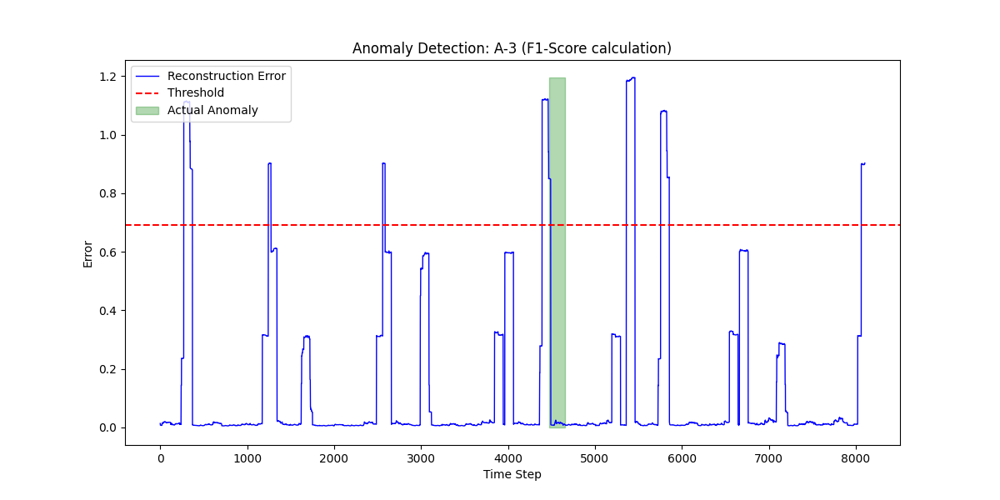
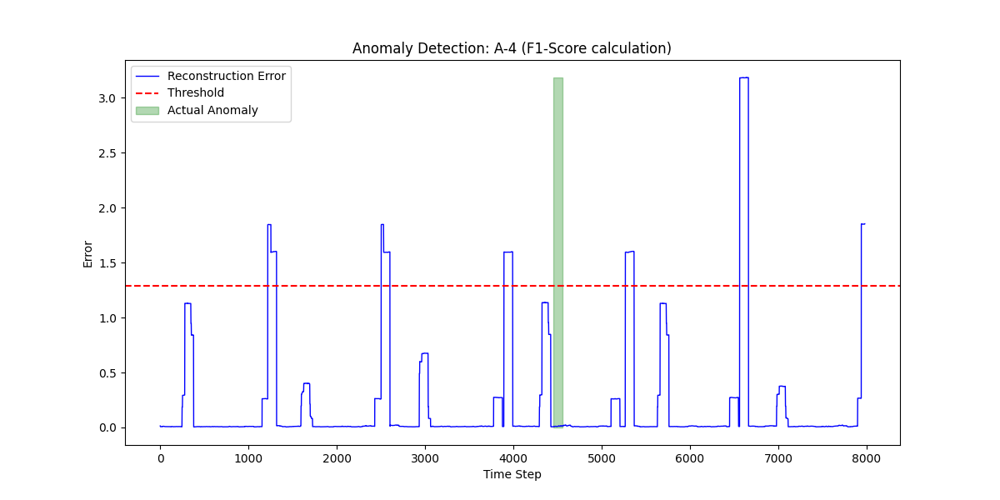

# Multivariate Time Series Anomaly Detection (NASA SMAP) Abdullah Ahsen 22i-0802

## 📌 Project Overview
This repository implements a robust Deep Learning framework for detecting anomalies in multivariate time series data. Addressing the challenge of data contamination and lack of labels in real-world sensor data, the model integrates **Geometric Masking**, **Transformers**, **Contrastive Learning**, and **GANs** to learn robust representations of normal behavior.

This project was implemented as part of the **Data Mining Semester Project (Fall 2025)**.

---

## 📂 1. Dataset Used
* **Dataset Name:** NASA Soil Moisture Active Passive (SMAP).
* **Type:** Multivariate Time Series.
* **Dimensions:** 25 separate sensor channels (variables) tracked simultaneously.
* **Source:** [Telemanom / OmniAnomaly Repository](https://github.com/khundman/telemanom).
* **Data Structure:**
    * `data/train`: Nominal data used to teach the model "normal" behavior.
    * `data/test`: Data containing anomalies used for evaluation.
    * `labeled_anomalies.csv`: Ground truth labels provided by NASA experts.

   ---   

## 🛠️ 2. Methodology & Preprocessing

### Preprocessing Steps
1.  **Normalization:** All data is standardized (Zero Mean, Unit Variance) to ensure stable training.
2.  **Sliding Window:** The continuous time series is sliced into fixed windows of size **T=100** to capture temporal context.
3.  **Geometric Masking:** A key component of this framework. We randomly mask contiguous segments of the input data using a geometric distribution. This forces the model to learn to "repair" the data, making it robust to missing packets and noise.

### Model Architecture & Components
The framework uses a **Transformer-GAN** hybrid architecture:
* **Generator (Transformer):** A multi-head self-attention network that takes the *masked* sequence and attempts to reconstruct the *original* sequence.
* **Discriminator (MLP):** A binary classifier that tries to distinguish between the original signal and the Generator's reconstruction.
* **Contrastive Loss:** A specific loss function that minimizes the distance between the feature representations of the masked and unmasked data, enforcing semantic consistency.

---

## ⚙️ 3. Training Procedure
The model is trained in an adversarial manner:
1.  **Adversarial Step:** The Discriminator is trained to detect fake (reconstructed) data.
2.  **Reconstruction Step:** The Generator is trained to minimize the **MSE** (Mean Squared Error) between its output and the original data.
3.  **Regularization:** We add **Contrastive Loss** to the Generator's objective to improve feature learning.

* **Epochs:** 20 (Selected to ensure GAN convergence).
* **Batch Size:** 64.
* **Optimizer:** Adam (LR=0.0005).

---

## 📊 4. Evaluation Metrics
We evaluate the model using standard classification metrics suitable for anomaly detection:
* **Precision:** What % of detected anomalies were actually real?
* **Recall:** What % of real anomalies did we find?
* **F1-Score:** The harmonic mean of Precision and Recall (primary metric).

An anomaly is flagged if the **Reconstruction Error** exceeds a dynamic threshold:
$$Threshold = \mu + 2\sigma$$

### Full Results Data
We trained and evaluated the model on 4 distinct channels (A-1, A-2, A-3, A-4). The complete metrics for every channel are available in the CSV below.

[📥 **Download Full Evaluation Metrics (CSV)**](evaluation_metrics.csv)

*(Note: Click the link above to view the Precision, Recall, and F1-Scores for all channels.)*

---

## 📈 5. Visual Demonstration

Below are the anomaly detection plots for the 4 tested channels.
* **Blue Line:** Reconstruction Error (Model Uncertainty).
* **Red Line:** Anomaly Threshold ($\mu + 2\sigma$).
* **Green Areas:** Actual Ground Truth Anomalies.

### Channel A-1


### Channel A-2


### Channel A-3


### Channel A-4


---

## 💻 6. Code Structure & Reproducibility
The project is organized for modularity and ease of use.

```text
22i0802_DataMiningProject/
│
├── main.py                 # ENTRY POINT
│   ├── Runs the Training Loop (Adversarial Training).
│   ├── Evaluates the model on Test Data.
│   ├── Generates Plots (.png) and Metrics (.csv).
│
├── model.py                # NEURAL NETWORK LOGIC
│   ├── TransformerGenerator: The main Transformer model.
│   ├── Discriminator: The GAN critic network.
│   ├── contrastive_loss: The custom loss function.
│
├── utils.py                # DATA PIPELINE
│   ├── load_smap_data: Reads .npy files and CSV labels.
│   ├── geometric_masking: Implements the robust masking strategy.
│   ├── TimeSeriesDataset: PyTorch Dataset class.
│
├── evaluation_metrics.csv  # FINAL RESULTS (Generated)
├── labeled_anomalies.csv   # GROUND TRUTH (Provided)
├── requirements.txt        # DEPENDENCIES
├── README.md               # DOCUMENTATION
│
└── data/                   # DATASET
    ├── train/              # Training files
    └── test/               # Testing files
